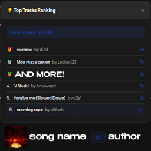

# Track Stats - Spicetify Extension

Advanced track statistics plugin for Spotify that displays comprehensive listening analytics with interactive features.



## 📥 Installation

### Method 1: Spicetify Marketplace (Recommended)
1. Install [Spicetify Marketplace](https://github.com/spicetify/spicetify-marketplace)
2. Search for "Track Stats" in the Extensions tab
3. Click Install

### Method 2: Manual Installation
1. Download the latest release from [Releases](https://github.com/knifeswx/track-stats/releases)
2. Copy `timer_by_knifeswx.js` to your Spicetify extensions folder:
   - Windows: `appdata\local\spicetify\Extensions\`
   - macOS: `~/spicetify_data/Extensions/`
   - Linux: `~/.config/spicetify/Extensions/`
3. Add the extension to your config:
   ```bash
   spicetify config extensions timer_by_knifeswx.js
   spicetify apply
   ```
   
## 🧹 Clearing Data

To reset all statistics:
1. Open Spotify Developer Tools (Ctrl+Shift+I)
2. Go to Console tab
3. Type: `clearTrackStats()`
4. Press Enter

## 🤝 Contributing

Contributions are welcome! Please feel free to submit a Pull Request.

## 📄 License

This project is licensed under the MIT License - see the [LICENSE](LICENSE) file for details.

## 🙏 Acknowledgments

- [Spicetify](https://spicetify.app/) - For the amazing Spotify customization platform
- [Spicetify Creator](https://github.com/spicetify/spicetify-creator) - For the development tools
